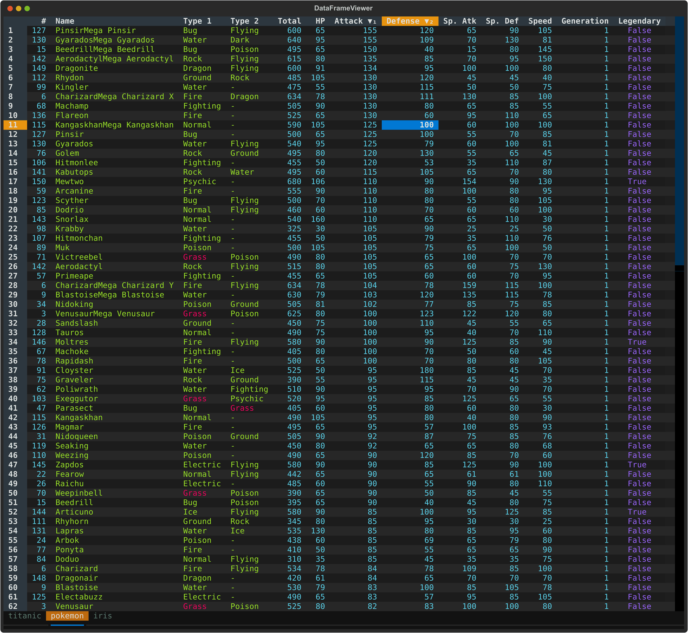

# DataFrame Viewer

A powerful, interactive terminal-based CSV viewer built with Python, Polars, and Textual. Inspired by VisiData, this tool provides smooth keyboard navigation, data manipulation, and a clean interface for exploring CSV data directly in your terminal.



## Features

- 🚀 **Fast CSV Loading** - Powered by Polars for efficient data handling with lazy pagination
- 🎨 **Rich Terminal UI** - Beautiful, color-coded columns with automatic type detection
- ⌨️ **Comprehensive Keyboard Navigation** - Intuitive controls for browsing, editing, and manipulating data
- 📊 **Flexible Input** - Read from files or stdin (pipes/redirects)
- 🔄 **Smart Pagination** - Lazy load rows on demand for handling large datasets
- 📝 **Data Editing** - Edit cells, delete rows, and remove columns
- 🔍 **Search & Filter** - Find values, highlight matches, and filter selected rows
- ↔️ **Column/Row Reordering** - Move columns and rows with simple keyboard shortcuts
- 📈 **Sorting & Statistics** - Multi-column sorting and frequency distribution analysis
- � **Save & Undo** - Save filtered data back to CSV with full undo/redo support
- 📌 **Pin Rows/Columns** - Keep important rows and columns visible while scrolling
- 🎯 **Cursor Type Cycling** - Switch between cell, row, and column selection modes

## Installation

### Using uv (recommended)

```bash
# Clone or download the project
cd dataframe-viewer

# Run directly with uv
uv run python main.py <csv_file>
```

### Using pip

```bash
pip install polars textual
python main.py <csv_file>
```

## Usage

### Basic Usage

```bash
# View a CSV file
python main.py pokemon.csv

# Or with uv
uv run python main.py pokemon.csv

# Read from stdin
cat data.csv | python main.py
python main.py < data.csv
```

## Keyboard Shortcuts

### Navigation

| Key | Action |
|-----|--------|
| `g` | Jump to first row |
| `G` | Jump to last row (loads all remaining rows) |
| `↑` / `↓` | Move up/down one row |
| `←` / `→` | Move left/right one column |
| `PageDown` / `PageUp` | Scroll down/up |
| Arrow keys | Navigate the table |

### Viewing & Display

| Key | Action |
|-----|--------|
| `Enter` | View full details of current row in modal |
| `#` | Toggle row labels visibility |
| `C` (Shift+C) | Cycle cursor type: cell → row → column → cell |
| `k` | Toggle dark mode |

### Data Editing

| Key | Action |
|-----|--------|
| `e` | Edit current cell (respects data type) |
| `d` | Delete current row |
| `-` | Delete current column |

### Searching & Filtering

| Key | Action |
|-----|--------|
| `\|` (pipe) | Search in current column (case-insensitive) |
| `\` | Search current column using cell value |
| `t` | Toggle highlighting of selected rows |
| `T` (Shift+T) | Clear all selected rows |
| `"` (quote) | Filter to show only selected rows |
| `f` | Filter by expression (powerful syntax for complex filters) |

### Sorting

| Key | Action |
|-----|--------|
| `[` | Sort current column ascending |
| `]` | Sort current column descending |
| `F` (Shift+F) | Show frequency distribution for column |

### Reordering

| Key | Action |
|-----|--------|
| `Shift+←` | Move current column left |
| `Shift+→` | Move current column right |
| `Shift+↑` | Move current row up |
| `Shift+↓` | Move current row down |

### Advanced

| Key | Action |
|-----|--------|
| `p` | Pin rows and columns (set fixed rows/columns) |
| `c` | Copy current cell to clipboard |
| `Ctrl+S` | Save dataframe to CSV file |
| `u` | Undo last action |
| `U` | Reset or reload entire table |
| `q` | Quit viewer |

## Features in Detail

### 1. Color-Coded Data Types

Columns are automatically styled based on their data type:
- **Int64** (Integers): Cyan text, right-aligned
- **Float64** (Decimals): Magenta text, right-aligned
- **String**: Green text, left-aligned
- **Boolean**: Blue text, centered
- **Date/Datetime**: Blue text, centered

### 2. Row Detail View

Press `Enter` on any row to open a modal showing all column values for that row. Useful for examining wide datasets where columns don't fit on screen.

### 3. Search & Filtering

**Column Search** (`|`):
- Search for values in the current column
- Case-insensitive substring matching
- All matching rows are highlighted in red
- Multiple searches accumulate selections

**Cell-Value Search** (`\`):
- Automatically search using the current cell's value
- Quick way to find all occurrences of a value

**Row Filtering** (`"`):
- Display only the selected (highlighted) rows
- Other rows are hidden but preserved
- Use undo (`u`) to restore

### 4. Filter by Expression

Press `f` to open a powerful filter expression dialog. This allows you to write complex filter conditions using a special syntax:

**Column References:**
- `$_` - Current column (based on cursor position)
- `$1`, `$2`, etc. - Column by 1-based index
- `$age`, `$salary` - Column by name

**Operators:**
- Comparison: `==`, `!=`, `<`, `>`, `<=`, `>=`
- Logical: `&&` (AND), `||` (OR)
- Arithmetic: `+`, `-`, `*`, `/`, `%`

**Examples:**
- `$_ > 50` - Current column greater than 50
- `$salary >= 100000` - Salary at least 100,000
- `$age < 30 && $status == 'active'` - Age less than 30 AND status is active
- `$name == 'Alice' || $name == 'Bob'` - Name is Alice or Bob
- `$salary / 1000 >= 50` - Salary divided by 1,000 is at least 50

See [FILTER_EXPRESSION_GUIDE.md](FILTER_EXPRESSION_GUIDE.md) for comprehensive syntax documentation.

### 5. Sorting

- Press `[` to sort current column ascending
- Press `]` to sort current column descending
- Multi-column sorting supported (press multiple times on different columns)
- Press same key twice to toggle direction
- Frequency view (`F`) shows value distribution with optional sorting

### 6. Frequency Distribution

Press `F` to see how many times each value appears in the current column. The modal shows:
- Value
- Count
- Percentage of total

### 7. Data Editing

**Edit Cell** (`e`):
- Opens modal for editing current cell
- Validates input based on column data type
- Shows column name and type
- Integer, number, and text inputs available

**Delete Row** (`d`):
- Delete single row at cursor
- Or delete all selected rows at once
- Deleted rows are marked internally but kept for undo

**Delete Column** (`-`):
- Removes the entire column from view and dataframe
- Cannot be undone directly (use undo feature)

### 8. Column & Row Reordering

**Move Columns**: `Shift+←` and `Shift+→`
- Swaps adjacent columns
- Reorder is preserved when saving

**Move Rows**: `Shift+↑` and `Shift+↓`
- Swaps adjacent rows
- Visual reordering without affecting data

### 9. Pin Rows and Columns

Press `p` to open the pin dialog:
- Enter number of fixed rows: keeps top rows visible while scrolling
- Enter two numbers: `<rows> <columns>` (space-separated)
- Example: `2 3` pins top 2 rows and left 3 columns

### 10. Save to CSV

Press `Ctrl+S` to save:
- Save filtered, edited, or sorted data back to CSV
- Choose filename in modal dialog
- Confirm if file already exists
- Automatic .tsv or .csv detection

### 11. Undo/Redo

Press `u` to undo:
- Reverts last action with full state restoration
- Works for edits, deletions, sorts, searches, etc.
- Shows description of reverted action

### 12. Cursor Type Cycling

Press `C` to cycle through selection modes:
1. **Cell mode**: Highlight individual cell (and its row/column headers)
2. **Row mode**: Highlight entire row
3. **Column mode**: Highlight entire column

Visual feedback shows which mode is active.

### 13. Clipboard Operations

Press `c` to copy:
- Copies current cell value to system clipboard
- Works on macOS (`pbcopy`) and Linux (`xclip`)
- Shows confirmation notification

## Data Type Support

- **Int64, Int32, UInt32**: Integer values
- **Float64, Float32**: Decimal numbers (shown with 4 significant figures)
- **String**: Text data
- **Boolean**: True/False values
- **Date**: ISO date format (YYYY-MM-DD)
- **Datetime**: ISO datetime format
- **Null values**: Displayed as `-`

## Examples

```bash
# View Pokemon dataset
python main.py pokemon.csv

# View Titanic dataset with analysis
python main.py titanic.csv

# Filter and view specific columns
cut -d',' -f1,2,3 pokemon.csv | python main.py

# View with grep filter (then use | search in viewer)
grep "Fire" pokemon.csv | python main.py

# Chain with other commands
cat data.csv | sort -t',' -k2 | python main.py
```

## Performance

- **Lazy loading**: Only loads visible rows + 10 rows ahead
- **Efficient sorting**: Uses Polars' optimized sort algorithms
- **Smooth scrolling**: No lag when paging through large files
- **Memory efficient**: Handles datasets larger than RAM

Tested with:
- 10,000+ row CSV files
- Wide datasets (100+ columns)
- Various data types and sizes

## Dependencies

- **polars**: Fast DataFrame library for CSV processing
- **textual**: Terminal UI framework
- **rich**: Rich text and formatting in the terminal

## Technical Details

- Built with Textual's reactive framework for smooth updates
- Custom DataTable subclass with intelligent highlighting
- Polars for efficient CSV parsing and lazy row loading
- Direct `/dev/tty` access for keyboard input when reading from stdin
- History/undo system with full state snapshots
- Modal screens for search, edit, save, and pin operations

## Requirements

- Python 3.8+
- POSIX-compatible terminal (macOS, Linux, WSL)
- Terminal supporting ANSI escape sequences and mouse events

## Troubleshooting

**Issue**: Some keys not working
- Terminal might not support all key combinations
- Try different keyboard shortcuts (e.g., `[` instead of Shift+[)

**Issue**: Can't read from pipe
- Make sure you have proper permissions to read from `/dev/tty`
- Some terminal emulators may not support this

**Issue**: Slow with large files
- First load time depends on CSV size
- Subsequent navigation is optimized with pagination
- Sorting/searching on large columns may take a moment

**Issue**: Colors not showing correctly
- Ensure your terminal supports 256 colors or truecolor
- Check `TERM` environment variable: `echo $TERM`

## Acknowledgments

- Inspired by [VisiData](https://visidata.org/)
- Built with [Textual](https://textual.textualize.io/), [Polars](https://www.pola.rs/), and [Rich](https://rich.readthedocs.io/)
- All code created through iterative development
